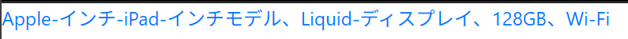

# growi-plugin-embed-book

## Usage

### Basic

Embed Amazon URL.

```markdown
https://www.amazon.co.jp/%E3%83%8F%E3%83%B3%E3%82%BA%E3%82%AA%E3%83%B3Node-js-%E4%BB%8A%E6%9D%91-%E8%AC%99%E5%A3%AB/dp/4873119235/
```

#### Notice

If you want to ignore the embed, you can use the URL as `www.amazon.jp` instead of `www.amazon.co.jp`.


## View

* Link with the cover picture of the book and the book title.

    * for example:

        If you write follow url on the markdown, the cover picture and the title is shown on the growi page.

        https://www.amazon.co.jp/%E3%83%8F%E3%83%B3%E3%82%BA%E3%82%AA%E3%83%B3Node-js-%E4%BB%8A%E6%9D%91-%E8%AC%99%E5%A3%AB/dp/4873119235/

        

* If the link is not for books, Link with the title.

    * for example:

        If you write follow url on the markdown, only the the title is shown on the growi page.

        https://www.amazon.co.jp/Apple-%E3%82%A4%E3%83%B3%E3%83%81-iPad-%E3%82%A4%E3%83%B3%E3%83%81%E3%83%A2%E3%83%87%E3%83%AB%E3%80%81Liquid-%E3%83%87%E3%82%A3%E3%82%B9%E3%83%97%E3%83%AC%E3%82%A4%E3%80%81128GB%E3%80%81Wi-Fi/dp/B0DZ7WF87P/

        

## CSS Customize 

* The generated HTML is like following. You can make custom css for the output.

```HTML
<div class="book">
    <a href="https://www.amazon.co.jp/{title}/dp/{asin}/">
        
        <br>
        {title}
    </a>
</div>
```

* For example

```CSS
.book img {
  max-width: 100%;
  height: auto;
}
```

## License

MIT

## Thanks

This plugin is a fork of the [growi-pulgin-embed-youtube](https://github.com/goofmint/growi-plugin-embed-youtube).

Thank you.